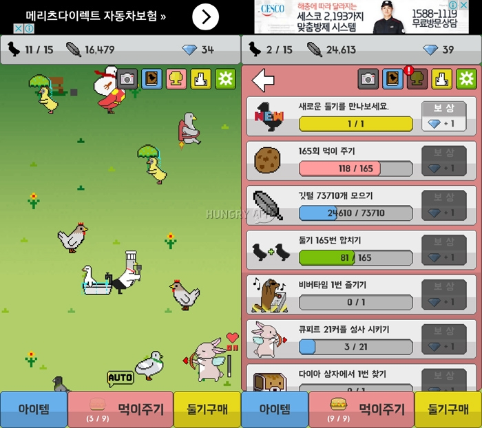

### Discrete event modeling practice
* Programmed by using python Simpy package.
* IDE: I used PyCharm for easily play with Python. DES is a PyCharm project.
* Doolgi example is also included in DES project.

### Doolgi(Pigeon) example
[비둘기키우기](https://play.google.com/store/apps/details?id=com.Mouse_Duck.DoveGame&hl=ko) is an addictive game which is getting popular(+100k users) in the Android Market. Main objective of this game is collect 36 different types of pigeons. 

#### Brief introduction of this game
* Generating pigeon: A pigeon is generated by putting a meal on the ground, a level of pigeon is decided by the level of your meal. For example if your meal is level 5, a pigeon with level $x~Uniform(1-5)$ is generated. Number of total pigeons in the ground can be increased by upgrading utilities.  
* Game money
	* Feathers: Pigeons are collecting feathers periodically, by upgrading feature collection interval to the max level, collecting interval is shorten to 1.0 seconds. Feather can be used to upgrade utilities or buy additional pigeons. 
		* Available tilities to upgrade: Level of your meal(+1), Decreasing collecting interval(-0.2sec), Total number of available pigeons in the ground(+1), Total number of meals you can possess at once(+1), Meal generating interval(-0.2sec)
		* For each upgrade, you need exponential amount of features
	* Diamonds: Diamonds are something similar to cash items, but in this game you don't have to pay cash to get diamonds. By breaking pigeon egg(which occurs in the ground periodically) gives you a diamond with high probability, or you can watch short(15-30sec) ads to get 3 diamonds. Diamond can be used to upgrade additional utilities in the game.
		* Available utilities to upgrade: Automatic merging(a.k.a. Arrow of cupid -1sec, 30sec), Automatic feeding(-1sec, 30sec), DJ Beaver time(-10sec, 200sec), +2 level upgrade(Hamster Magic, +2%, 10%), Moving restriction, Merging restriction
		* These functions are activated by 50 diamonds at first, and additional upgrade needs 60, 70, 80, 90, 100 diamonds. Moving and merging restriction needs 100 diamonds to activate.
* Merging pigeons: A pigeon with level n+1 is generated by merging two pigeons with level n. Higher-level pigeon collects more feathers at the same time. 
	* Number of feathers collected by each pigeon, each time: f(1) = 1, f(2) = 2, f(3) = 3, f(n) = f(n-3) + f(n-1), n > 4 

#### What did I model in this project?
* trial_doolgi.py: Contains 
* experiment_doolgi.py: Code for experiment
